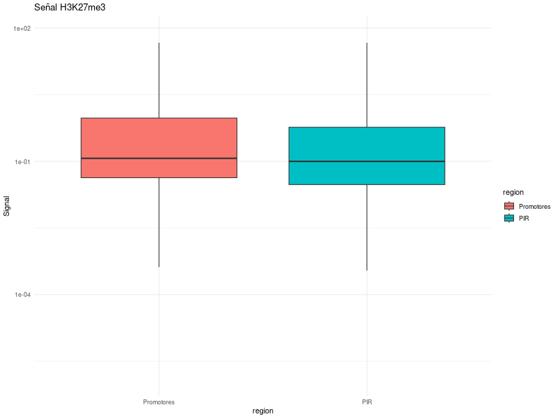

---

title: "Proyecto Epigenómica"

author: "Sofia Gamino, Jorgue Alfredo Suazo Victoria, Emiliano Ferro Rodriguez."

date: "2025-05-05"

output: html_document

---

# Introducción

En los últimos años, hemos descubierto que las modificaciones epigenómicas son una parte vital de la regulación de la expresión en Eucariotes. Esto es así por varias razones. Entre ellas, una es que cada célula tiene que expresar un set de genes específicos a lo largo de su vida con mucha precisión, y aparte tiene que responder a estímulos externos. Es aquí donde entran los Factores Transcripcionales. Estas son proteínas que se unen a sitios específicos del ADN llamados motivos. Así, dependiendo de la disponibilidad de estos factores desde el nacimiento, se puede modular con precisión de relojero la expresión genómica de cada célula.

En este reporte, abordaremos métodos bioinformáticos para poder conocer motivos activos en varios tipos celulares por medio de Promoter capture Hi-C, un método que nos permite conocer motivos y promotores activos en cada tipo celular por medio de las interacciones espaciales entre ellos.

Posteriormente, añadiremos análisis estadísticos para probar la veracidad de los datos obtenidos por medio de este método.

Basado en el artículo Javierre, B.M., Burren, O.S., Wilder, S.P., Kreuzhuber, R., Hill, S.M., Sewitz, S., Cairns, J., Wingett, S.W., Várnai, C., Thiecke, M.J., Burden, F., Farrow, S., Cutler, A.J., Rehnström, K., Downes, K., Grassi, L., Kostadima, M., Freire-Pritchett, P., Wang, F., Stunnenberg, H.G., Todd, J.A., Zerbino, D.R., Stegle, O., Ouwehand, W.H., Frontini, M., Wallace, C., Spivakov, M., Fraser, P., 2016. Lineage-Specific Genome Architecture Links Enhancers and Non-coding Disease Variants to Target Gene Promoters. Cell 167, 1369-1384.e19. DOI: 10.1016/j.cell.2016.09.037

# Documentación

Para el análisis epigenómico, creamos un pipeline en bash que nos permite desde filtrar los datos de las interacciones para nuestro tipo celular elegido (Macrófagos M1) hasta hacer el análisis de significancia estadística. El workflow del pipeline está en Projecto-Epigenomica/pipeline.sh, y su organización será descrita a continuación. (*La dirección de los resultados en el cluster es: mnt/atgc-d1/bioinfoII/jsuazo/Epigenetica_Pipeline_PCHi-C*)

```

# Preview de la estructura de nuestro proyecto

├── data

├── enrichment_analysis.R

├── jobs

├── logs

├── Parse_Data.R

├── pipeline.sh

├── Prueba_diferenciacion.R

└── results

```

El pipeline se divide en 10 secciones. No todas fueron necesarias para responder la primera pregunta, pero sí son necesarias para hacer el análisis de enriquecimiento de TFs en los Promotores y PIRs originales y parseados. Para correrlo, es necesario tener cargados los módulos bedtools/2.26, rsat/8sep2021, bigWigAverageOverBed.

0. Definición de los parámetros: En esta parte se definien lo parámetros de entrada que se tienen que ingresar para el correcto funcionamiento del pipeline. Se le tiene que dar la tabla de datos de la información de las interacciones, el tipo celular, una URL o ruta hacia el genoma de referencia (h19), el archivo BigWig de la búsqueda de la histona, la matriz de motivos de JASPAR con todos los sitios de unión de TFs para vertebrados y, finalmente, el mínimo de score de cada hit que tomemos con matrix-scan.

01. Creación del job de matrix-scan: En este sitio se organiza el formato para subir el job de matrix-scan al cluster. Los argumentos serán dados casi al final del pipeline.

1. Extracción de BED de promotores y PIRs: Con ayuda del script Proyecto-Epigenomica/Parse_Data.R y la tabla de datos de las interacciones, podemos extraer los BEDs de los Promotores y los PIRs. Los resultados se guardarán en la carpeta Proyecto-Epigenomica/Data. EL script usado es:

```{r, eval=FALSE}

#!/usr/bin/env Rscript

# --------------------------------------------------------

# Extraer datos PCHiC con barra de progreso

# Uso: Rscript Parse_Data.R <data_table> <cell_type>

# --------------------------------------------------------

# 1) Extraer argumentos del comando

args <- commandArgs(trailingOnly = TRUE)

if (length(args) < 2) {

  stop("Uso: Rscript Parse_Data.R <data_table> <cell_type>")

}

data_table <- args[1]

cell_type  <- args[2]

# Definir pasos y barra de progreso

steps <- c("Leyendo tabla", "Filtrando datos", "Obteniendo Promotores", "Obteniendo PIRs")

pb    <- txtProgressBar(min = 0, max = length(steps), style = 3)

step  <- 0

# 2) Leer la tabla

step <- step + 1

cat(sprintf("[%d/%d] %s...\n", step, length(steps), steps[step]))

setTxtProgressBar(pb, step)

raw_data <- read.table(data_table, header = TRUE)

# Validar que la célula existe

if (!(cell_type %in% colnames(raw_data))) {

  close(pb)

  stop(paste("La célula", cell_type, "no se encuentra en la tabla."))

}

# 3) Filtrar filas con score > 5

step <- step + 1

cat(sprintf("[%d/%d] %s...\n", step, length(steps), steps[step]))

setTxtProgressBar(pb, step)

filtered_data <- raw_data[ raw_data[[cell_type]] > 5, ]

# 4) Obtener Promotores

step <- step + 1

cat(sprintf("[%d/%d] %s...\n", step, length(steps), steps[step]))

setTxtProgressBar(pb, step)

promotores <- filtered_data[, c("baitChr", "baitStart", "baitEnd", "baitID")]

colnames(promotores) <- c("chr", "start", "end", "ID")

promotores <- promotores[!duplicated(promotores), ]

promotores$chr <- paste0("chr", promotores$chr)

write.table(promotores,

            file = paste0("data/promotores_", cell_type, ".bed"),

            sep = "\t", quote = FALSE,

            row.names = FALSE, col.names = FALSE)

# 5) Obtener PIRs

step <- step + 1

cat(sprintf("[%d/%d] %s...\n", step, length(steps), steps[step]))

setTxtProgressBar(pb, step)

PIR <- filtered_data[, c("oeChr", "oeStart", "oeEnd", "oeID")]

colnames(PIR) <- c("chr", "start", "end", "ID")

PIR <- PIR[!duplicated(PIR), ]

PIR$chr <- paste0("chr", PIR$chr)

write.table(PIR,

            file = paste0("data/PIR_", cell_type, ".bed"),

            sep = "\t", quote = FALSE,

            row.names = FALSE, col.names = FALSE)

# Cerrar barra de progreso

close(pb)

cat(sprintf("Proceso completado. Archivos en data/: promotores_%s.bed, PIR_%s.bed\n", cell_type, cell_type))

```

2. Descarga o uso local del genoma hg19.fa: En este paso, en caso de que no hayas ingresado una dirección específica al genoma de referencia, se usará la versión h19 de humano en el cluster.

3. Extracción de secuencias FASTA: Con ayuda del módulo bedtools 2.26, se usa la función getfasta para extraer los fastas de los BED ya filtrados en el paso 2 y el genoma de referencia. Estos fastas filtrados se guardarán en la carpeta Proyecto-Epigenomica/Data también. 

3.1 Normalizar a mayúsculas: Se transforma el formato de los nucleótidos de minúsculas a mayúsculas para evitar problemas de compatibilidad. También al final creamos el archivo FASTA combinado de los PIRs y Promotores, que nos será útil en los siguientes pasos. 

4. Señal con bigWigAverageOverBed: Con ayuda de bigWigAverageOverBed, se forma un archivo.tab que contiene la intensidad de la señal de cada sitio de la histona de nuestro interés. 

5. Gráficas con Rscript: En este paso, con ayuda del script Proyecto-Epigenomica/Prueba_diferenciacion.R y las tablas producidas en el paso anterior. Se produce un boxplot comparando la intensidad de señal entre PIRs y Promotores (almacenado en la tabla Data), así como un test de Wilcoxon, con este último en **Proyecto-Epigenomica/resultados/wilcox_results.txt.

** A partir de aquí, el pipeline funciona solo para analizar el enriquecimiento de motivos en PIRs y Promotores para contestar la segunda pregunta.

6. Permutación de matriz JASPAR: Permutamos las matrices de motivos descargadas de JASPAR para así no tener la necesidad de permutar el genoma completo. Permutar la matriz de motivos tiene el mismo impacto que hacerlo en el genoma, porque representa hits aleatorios en el genoma que pueden ser usados como control. El resultado se guarda en la carpeta Data como {tipo célular}_perm.txt. La función usada para esto viene de rsat y es permute-matrix.

7. Modelo background común: En este paso se genera un modelo de fondo válido para los fastas de los PIRs y Promotores, por medio del fasta combinado. Usamos este fasta con la opción oligo-analysis para crear el modelo de fondo con las frecuencias combinadas de ambas regiones. Este modelo de fondo será usado para poder crear el job de matrix-scan.

8. Generación y envío de jobs matrix-scan: En este punto, ya tenemos todos los argumentos para pasarle al job de matrix scan, entonces le damos estos datos para hacer cuatro jobs: uno con el matrix-scan de PIRs originales, otro con el matrix-scan de Promtores originales , y otros iguales, solo que usando la matriz permutada,

9. Esperar a que los archivos de salida existan y no estén vacíos: Este paso solo asegura que los archivos de salida no estén vacios.

10.  Análisis de enriquecimiento vía R: El último paso. En este, ya que tenemos todos nuestros resultados, podemos hacer un conteo de los hits significativos de cada motivo para poder analizar cuáles son comunes para ambas regiones. Se crea una carpeta individual dentro de la carpeta de results para cada conteo de motivos.

 

```{r,eval=FALSE}

# --------------------------------------------------------

set -euo pipefail

if [ $# -lt 7 ]; then

  echo "Uso: $0 <data_table> <cell_type> <hg19_fa_url|ruta> <bigWig_file> <histone_mark> <jaspar_matrix> <score_threshold>" >&2

  exit 1

fi

# Parámetros

DATA_TABLE=$1

CELL_TYPE=$2

HG19_FASTA=$3

BIG_WIG=$4

HISTONE=$5

JASPAR_MATRIX=$6

SCORE_THRES=$7

# Crear directorios si no existen

mkdir -p data results logs jobs

# Función de progreso con hélice de ADN animada

#Codigo para hacer la hélice de carga del pipeline. Para verlo completo puedes ir al .sh en el github.

# Función para generar scripts de job de matrix-scan

generate_matrixscan_job() {

  local seq_fa=$1      # Archivo FASTA de entrada

  local bgfile=$2      # Archivo background

  local matrix=$3      # Matriz JASPAR o permutada

  local output=$4      # Archivo de salida

  local desc=$5        # Descripción amigable

  local job_name=$6    # Nombre del job

  cat <<EOF > jobs/job_${job_name}.sge

#!/bin/bash

#$ -cwd

#$ -j y

#$ -S /bin/bash

#$ -N ${job_name}

#$ -o logs/${job_name}.o

#$ -e logs/${job_name}.e

#$ -m e

#$ -M tu_correo@dominio.com

. /etc/profile.d/modules.sh

module load rsat/8sep2021

rsat matrix-scan \

  -quick \

  -i "${seq_fa}" \

  -bgfile "${bgfile}" \

  -m "${matrix}" \

  -matrix_format transfac \

  -bg_pseudo 0.01 \

  -lth score "${SCORE_THRES}" \

  -return sites,pval,rank \

  -o "results/${output}"

EOF

  chmod +x jobs/job_${job_name}.sge

}

# 1) Extracción de BED de promotores y PIRs

echo "==> Extrayendo datos de $DATA_TABLE para $CELL_TYPE"

Rscript Parse_Data.R "$DATA_TABLE" "$CELL_TYPE" & pid=$!; show_progress $pid "Extracción de datos"

# 2) Descarga o uso local del genoma hg19.fa

if [[ "$HG19_FASTA" =~ ^https?:// ]]; then

  echo "==> Descargando genoma desde $HG19_FASTA"

  wget --timestamping "$HG19_FASTA" & pid=$!; show_progress $pid "Descarga del genoma"

  GENOME=$(basename "$HG19_FASTA" .gz)

  if [[ "$HG19_FASTA" == *.gz ]]; then

    echo "==> Descomprimiendo ${GENOME}.gz"

    gunzip -f "${GENOME}.gz" & pid=$!; show_progress $pid "Descompresión del genoma"

  fi

else

  GENOME="$HG19_FASTA"

  echo "==> Usando genoma local: $GENOME"

fi

PROM_BED="data/promotores_${CELL_TYPE}.bed"

PIR_BED="data/PIR_${CELL_TYPE}.bed"

sed -i 's/^chrMT\t/chrM\t/' "$PROM_BED" "$PIR_BED"

# 3) Extracción de secuencias FASTA

echo "==> Extrayendo secuencias FASTA"

bedtools getfasta -fi "$GENOME" -bed "$PROM_BED" -fo "data/promotores_${CELL_TYPE}.fa" & pid=$!; show_progress $pid "Extracción promotores FASTA"

bedtools getfasta -fi "$GENOME" -bed "$PIR_BED" -fo "data/PIR_${CELL_TYPE}.fa" & pid=$!; show_progress $pid "Extracción PIRs FASTA"

# Normalizar a mayúsculas

echo "==> Normalizando secuencias"

tr 'acgt' 'ACGT' < data/promotores_${CELL_TYPE}.fa > tmp.fa && mv tmp.fa data/promotores_${CELL_TYPE}.fa

tr 'acgt' 'ACGT' < data/PIR_${CELL_TYPE}.fa > tmp.fa && mv tmp.fa data/PIR_${CELL_TYPE}.fa

cat data/promotores_${CELL_TYPE}.fa data/PIR_${CELL_TYPE}.fa > data/combined_${CELL_TYPE}.fa

# 4) Señal con bigWigAverageOverBed

echo "==> Calculando señal (${HISTONE})"

bigWigAverageOverBed "$BIG_WIG" "$PROM_BED" data/prom_${CELL_TYPE}.tab & pid=$!; show_progress $pid "Señal promotores"

bigWigAverageOverBed "$BIG_WIG" "$PIR_BED" data/pir_${CELL_TYPE}.tab & pid=$!; show_progress $pid "Señal PIRs"

# 5) Gráficas con Rscript

echo "==> Generando gráficas"

Rscript Prueba_diferenciacion.R "$CELL_TYPE" "$HISTONE" > results/wilcox_results.txt & pid=$!; show_progress $pid "Generación de gráficas"

# 6) Permutación de matriz JASPAR

echo "==> Permutando matriz JASPAR"

permute-matrix -i "$JASPAR_MATRIX" -o data/${CELL_TYPE}_perm.txt -in_format transfac -out_format transfac & pid=$!; show_progress $pid "Permutación matriz"

# 7) Modelo background común

echo "==> Generando background común"

oligo-analysis -l 1 -i data/combined_${CELL_TYPE}.fa -format fasta -o data/bg_${CELL_TYPE}.txt -type dna & pid=$!; show_progress $pid "Background common"

BG=data/bg_${CELL_TYPE}.txt

# 8) Generación y envío de jobs matrix-scan

echo "==> Creando y enviando jobs de matrix-scan"

declare -a outputs

for stage in prom_orig prom_perm pir_orig pir_perm; do

  case "$stage" in

    prom_orig)

      input="data/promotores_${CELL_TYPE}.fa"; matrix="$JASPAR_MATRIX"; desc="promotores orig";;

    prom_perm)

      input="data/promotores_${CELL_TYPE}.fa"; matrix="data/${CELL_TYPE}_perm.txt"; desc="promotores perm";;

    pir_orig)

      input="data/PIR_${CELL_TYPE}.fa"; matrix="$JASPAR_MATRIX"; desc="PIR orig";;

    pir_perm)

      input="data/PIR_${CELL_TYPE}.fa"; matrix="data/${CELL_TYPE}_perm.txt"; desc="PIR perm";;

  esac

  output="quick_${stage}_${CELL_TYPE}.txt"

  outputs+=("results/${output}")

  job_name="matrixscan_${stage}_${CELL_TYPE}"

  generate_matrixscan_job "$input" "$BG" "$matrix" "$output" "$desc" "$job_name"

  qsub jobs/job_${job_name}.sge

done

# 9) Esperar a que los archivos de salida existan y no estén vacíos

echo "Esperando a que los 4 archivos de matrix-scan estén listos..."

while :; do

  all_done=true

  for f in "${outputs[@]}"; do

    if [ ! -s "$f" ]; then

      all_done=false

      break

    fi

  done

  if $all_done; then

    echo "Todos los archivos de matrix-scan están disponibles."

    break

  fi

  sleep 30

done

# 10) Análisis de enriquecimiento vía R

echo "==> Análisis de enriquecimiento de TFs"

Rscript enrichment_analysis.R \

  data/promotores_${CELL_TYPE}.fa \

  results/quick_prom_orig_${CELL_TYPE}.txt \

  results/quick_prom_perm_${CELL_TYPE}.txt \

  data/PIR_${CELL_TYPE}.fa \

  results/quick_pir_orig_${CELL_TYPE}.txt \

  results/quick_pir_perm_${CELL_TYPE}.txt \

  results/enrichment_${CELL_TYPE}

echo "  → Resultados guardados en: \

    results/enrichment_${CELL_TYPE}_promoters_stats.csv, \

    results/enrichment_${CELL_TYPE}_PIRs_stats.csv, \

    results/enrichment_${CELL_TYPE}_both_enriched.csv"

# Finalizar

echo -e "\n╔════════════════════════════════════════╗"

echo      "║       PIPELINE COMPLETADO              ║"

echo      "╚════════════════════════════════════════╝"

```

# Análisis

## ¿Hay mayor enriquecimiento de la histona X en los promotores o en los fragmentos? (Probarlo estadísticamente)

Para este análisis, solo se usaron los primeros 4 pasos de nuestro pipeline, ya que los 6 restantes fueron destinados a la búsqueda de TFs.

### Razón biológica de la histona analizada.

En nuestro caso, analizamos la modificación de la histona 3 H3K27me3 (Trimetilación de la Lisína 27 en la histona 3). Esta marca epigenética actúa como un silenciador. Su asociación con el ADN impide que este pueda asociarse con la maquinaria de transcripción. Se ha observado que en los sitios donde las proteínas del grupo PolyComb (relacionadas con el silenciamiento de genes del desarrollo y remodelación de la cromatina) se unen, específicamente en el dominio de las marcas de H3K27me3 ( <https://doi.org/10.1038/s41467-021-20940-y>), sugiriendo uno de los mecanismos en los que sucede la represión de genes a partir del desarrollo. Se ha sugerido que una buena forma de encontrar silenciadores en el genoma es por medio del análisis de las interacciones de los PcG (Polycomb Group proteins) con otros sitios lejos de su sitio de unión por medio de Hi-C, por lo que este podría ser un buen primer paso para la detección de complejos silenciadores en los Macrofagos M1. (Ngan, C. Y. et al. Chromatin interaction analyses elucidate the roles of PRC2-bound silencers in mouse development. Nat. Genet 52, 264–272 (2020).)

### Tomar los BigWigs adecuados del Blueprint. 

Biola M. Javierre et.al descargó los datos de CHIP-seq que son archivos fastq que tiene el proyecto BLUEPRINT de nueve células sanguíneas. Se utilizaron esos datos para estudiar las propiedades de la cromatina de las regiones de interacción con el promotor, es decir, los PIR. Los pasos que hicieron para obtener los archivos BigWigs a partir de los archivos fastq fueron:

El primer paso es descargar el output (que es el archivo fastq) del CHIP-seq obtenido de la data del proyecto BLUEPRINT se convertirá a un archivo de formato BAM.

En este paso, las herramientas que se usaron fueron bwa (Burrows-Wheeler Aligner) y samtools.

Este es un ejemplo del comando para convertir un archivo fastq a BAM.

```{bash, eval = FALSE}

bwa mem -t 4 reference_genome.fa sample_R1.fastq sample_R2.fastq | samtools view -b - > aligned_reads.bam

```

El siguiente paso, una vez teniendo los archivos, es filtrar y ordenar el archivo con ayuda de nuevo de la herramienta de samtools.

```{bash,eval = FALSE}

samtools view -b -q 30 aligned_reads.bam | samtools sort -o sorted_reads.bam -

```

Para obtener los archivos BigWig se usará la herramienta bedGraphToBigWig creada por UCSC Genome Browser Team que es también ampliamente usada por el consorcio ENCODE. Pero para usar esta herramienta requiere como input un archivo BEDgraph. Por lo tanto, una vez que obtenemos el archivo BAM filtrado y ordenado, convertimos ese archivo en un archivo BED con la herramienta bedtools.

```{bash, eval = FALSE}

bedtools bamtobed -i sorted_reads.bam > aligned_reads.bed

```

Ya teniendo listo el archivo BED con ayuda de bedtools calculamos la cobertura de este archivo, obteniendo como output el archivo BEDgraph.

```{bash, eval = FALSE}

bedtools genomecov -bg -ibam sorted_reads.bam -g genome_sizes.txt > coverage.bedGraph

```

Por último, ya teniendo el input para la herramienta bedGraphToBigWig y así con ello obtener el archivo BigWig.

```{bash, eval = FALSE}

bedGraphToBigWig coverage.bedGraph genome_sizes.txt output.bw

```

Cada una de las anteriores líneas de comando es cada paso para poder obtener por medio de un archivo FASTQ a BigWig.

### Resultados

Hicimos una prueba de wilcoxon para probar si hay una diferencia significativa entre las señales provenientes de PIRs y Promotores. Suponemos que, debido a que los Promotores activos en un tipo celular por definición están en un sitio abierto, mientras que puede que los PIRs si presenten esta marca sielciadora, va a haber una fuerza de la señal más grande en los PIRs.

Usamos una prueba de Wilcoxon debido a que es una prueba no paramétrica que evalua si dos grupos son diferentes, por lo cual no asume supuestos de normalidad. Lo único en lo que si tenemos que estár seguros es que hay una dependencia entre ambos grupos a comparar, la cual si que existe.

El análisis fue hecho en el pipeline (Epigenetica_Pipeline_PCHiC/pipeline.sh) en el Paso 5: Gráficas con Rscript. El script usado está en el sitio Proyecto-Epigenomica/Prueba_diferenciacion.R, y contiene lo siguiente:

```{r, eval=FALSE}

#!/usr/bin/env Rscript

# --------------------------------------------------------

# Uso: Rscript Prueba_diferenciacion.R <cell_type> <histone_mark>

# --------------------------------------------------------

# ---- Instalar paquetes si es necesario ----

required <- c('ggplot2')

installed <- rownames(installed.packages())

for(p in required){ if(!p %in% installed) install.packages(p, repos = 'https://cloud.r-project.org') }

args <- commandArgs(trailingOnly = TRUE)

if (length(args) < 2) {

  stop("Uso: Rscript Prueba_diferenciacion.R <cell_type> <histone_mark>")

}

cell_type <- args[1]

histone   <- args[2]

# Directorio de salida

outdir <- "data"

tasks <- c("Leyendo archivos de señal", 

           "Preparando dataframe", 

           "Generando gráfica", 

           "Realizando test estadístico")

pb <- txtProgressBar(min = 0, max = length(tasks), style = 3)

step <- 0

# 1) Leer archivos de señal

step <- step + 1

cat(sprintf("[%d/%d] %s...\n", step, length(tasks), tasks[step]))

setTxtProgressBar(pb, step)

prom_file <- file.path(outdir, paste0("prom_", cell_type, ".tab")) # Aquí es donde tomamos los resultados de blueprint.

pir_file  <- file.path(outdir, paste0("pir_",       cell_type, ".tab")) #Aqui igual

if (!file.exists(prom_file) || !file.exists(pir_file)) {

  close(pb)

  stop("No se encontraron los archivos:\n  ", prom_file, "\n  ", pir_file)

}

promotores  <- read.table(prom_file, header = FALSE)

pir         <- read.table(pir_file,  header = FALSE)

prom_signal <- promotores$V5  # Aquí tomamos la intensidad de la señal. Con estos datos vamos a hacer el boxplot y el wilcoxon test. 

pir_signal  <- pir$V5

# 2) Preparar dataframe

step <- step + 1

cat(sprintf("[%d/%d] %s...\n", step, length(tasks), tasks[step]))

setTxtProgressBar(pb, step)

signal <- c(prom_signal, pir_signal)

region <- factor(

  c(rep("Promotores", length(prom_signal)), rep("PIR", length(pir_signal))),

  levels = c("Promotores", "PIR")

)

df <- data.frame(signal = signal, region = region)

# 3) Generar gráfica

step <- step + 1

cat(sprintf("[%d/%d] %s...\n", step, length(tasks), tasks[step]))

setTxtProgressBar(pb, step)

plot_file <- file.path(outdir,paste0("signal_", cell_type, "_", histone, ".png"))

png(filename = plot_file, width = 800, height = 600)

suppressPackageStartupMessages(library(ggplot2))

ggplot(df, aes(x = region, y = signal, fill = region)) +

  geom_boxplot(outlier.shape = NA) +

  theme_minimal() +

  labs(title = paste0("Señal ", histone), y = "Signal") +

  scale_y_log10()

dev.off()

# 4) Realizar test de Wilcoxon

step <- step + 1

cat(sprintf("[%d/%d] %s...\n", step, length(tasks), tasks[step]))

setTxtProgressBar(pb, step)

test_res <- wilcox.test(prom_signal, pir_signal)

pval <- test_res$p.value

sig <- ifelse(pval < 0.05, "estadísticamente significativa", "no estadísticamente significativa")

close(pb)

cat("=== Resultados del test de Wilcoxon ===\n")

print(test_res)

cat(sprintf("\nLa diferencia entre Promotores y PIR es %s (p = %.3g).\n", sig, pval))

cat(sprintf("\nGráfica guardada en:\n  %s\n", plot_file))

```

Finalmente, los resultados se encuentran en Proyecto-Epigenomica/resultswilcox_results.txt . La documentación de todos los scripts se se ncuentra en el Github.

```         

            Wilcoxon rank sum test with continuity correction

data:  prom_signal and pir_signal

W = 845639694, p-value < 2.2e-16

alternative hypothesis: true location shift is not equal to 0

La diferencia entre Promotores y PIR es estadísticamente significativa (p = 5.1e-83).

```

Y también formamos boxplots usando logaritmos para reducir la significancia de valores extremos. En estos podemos ver que las diferencias abarcan varios niveles de magnitud.



Nuestros resultados, al contrario de nuestra hipótesis, señalan que hay una señal diferencialmente más alta de la marca epigenética H3K27me3 en las regiones de los Promotores, que en las de los PIRs. Esto podría deberse a que es muy importante controlar la accesibilidad de los promotores para una óptima diferenciación célular.

## ¿Qué TFs se encuentran enriquecidos en ambos sets de secuencias (promoters y fragmentos) ? (Usar pattern matching y probarlo estadísticamente)

Para hacer este análisis, todos los pasos de nuestro pipeline fueron usados y el resultado final contendría un csv con los conteos de hits significativos por motivo, así como los nombres de los TFs enriquecidos en los PIRs, Promotores, y ambos.

Desgraciadamente, nuestros jobs no alcanzaron a terminarse incluso si usamos matrix-scan con la opción quick, por lo que solo se explicará la lógica detras de el script que se encargó de hacer el análisis de enriquecimiento. Este script se encuentra en Proyecto-Epigenetica/enrichment_analysis.R:

Nosotros tomamos un enfoque donde, por cada motivo, hacemos una tabla de contingencia con la frecuencia de hits de las secuencias originales y de las secuencias permutadas (así como lo casos en donde no hubo hit). Ya con estas tablas, podemos hacer un test de fisher para cada motivo y evaluar si su p-valor es significativo o no. Así, podemos diferenciar un resultado significativo real de uno que pudo haber ocurrido por azar.

```{r, eval=FALSE}

#!/usr/bin/env Rscript

# enrichment_analysis.R

# ---- Instalar paquetes si es necesario ----

required <- c('Biostrings','dplyr')

installed <- rownames(installed.packages())

for(p in required){ if(!p %in% installed) BiocManager::install(p) }

suppressPackageStartupMessages({

  library(Biostrings)

  library(dplyr)

})

# --- Argumentos de línea de comandos ---

args <- commandArgs(trailingOnly = TRUE)

if(length(args) != 7) {

  stop("Uso: Rscript enrichment_analysis.R <prom_fasta> <prom_orig_out> <prom_perm_out> ",

       "<pir_fasta> <pir_orig_out> <pir_perm_out> <output_prefix>\n")

}

prom_fa    <- args[1]

prom_orig  <- args[2]

prom_perm  <- args[3]

pir_fa     <- args[4]

pir_orig   <- args[5]

pir_perm   <- args[6]

out_pref   <- args[7]

# --- Función para contar hits por motif ---

count_hits <- function(scan_file) {

  df <- read.table(scan_file, header=TRUE, sep="\t", comment.char=";")

  df %>% select(sequence_id, matrix_id) %>% distinct() %>%

    group_by(matrix_id) %>% summarise(hits = n()) %>% rename(motif = matrix_id)

}

# --- Contar número de secuencias en cada FASTA ---

n_prom <- length(readDNAStringSet(prom_fa))

n_pir  <- length(readDNAStringSet(pir_fa))

# --- Cargar conteos ---

prom_o <- count_hits(prom_orig)

prom_p <- count_hits(prom_perm)

pir_o  <- count_hits(pir_orig)

pir_p  <- count_hits(pir_perm)

# --- Unir con todos los motifs posibles ---

all_motifs <- unique(c(prom_o$motif, prom_p$motif, pir_o$motif, pir_p$motif))

df_prom <- tibble(motif = all_motifs) %>%

  left_join(prom_o, by="motif") %>% replace_na(list(hits=0)) %>% rename(h1=hits) %>%

  left_join(prom_p, by="motif") %>% replace_na(list(hits=0)) %>% rename(h0=hits) %>%

  rowwise() %>% mutate(

    pvalue = fisher.test(

      matrix(c(h1, h0, n_prom - h1, n_prom - h0), nrow=2),

      alternative = "greater"

    )$p.value

  ) %>% ungroup() %>% mutate(padj = p.adjust(pvalue, method="BH")) %>% arrange(padj)

df_pir <- tibble(motif = all_motifs) %>%

  left_join(pir_o, by="motif") %>% replace_na(list(hits=0)) %>% rename(h1=hits) %>%

  left_join(pir_p, by="motif") %>% replace_na(list(hits=0)) %>% rename(h0=hits) %>%

  rowwise() %>% mutate(

    pvalue = fisher.test(

      matrix(c(h1, h0, n_pir - h1, n_pir - h0), nrow=2),

      alternative = "greater"

    )$p.value

  ) %>% ungroup() %>% mutate(padj = p.adjust(pvalue, method="BH")) %>% arrange(padj)

# --- TFs enriquecidos (padj < 0.05) en ambos conjuntos ---

enr_prom <- df_prom %>% filter(padj < 0.05) %>% pull(motif)

enr_pir  <- df_pir  %>% filter(padj < 0.05) %>% pull(motif)

common   <- intersect(enr_prom, enr_pir)

# --- Guardar resultados ---

write.csv(df_prom, paste0(out_pref, "_promoters_stats.csv"), row.names=FALSE)

write.csv(df_pir,  paste0(out_pref, "_PIRs_stats.csv"),       row.names=FALSE)

write.csv(data.frame(motif=common), paste0(out_pref, "_both_enriched.csv"), row.names=FALSE)

# --- Mensajes finales ---

cat("\n--- TFs enriquecidos en PROMOTORES (padj<0.05):\n")

print(enr_prom)

cat("\n--- TFs enriquecidos en PIRs (padj<0.05):\n")

print(enr_pir)

cat("\n--- TFs comunes a ambos: \n")

print(common)

```

1. Argumentos de línea de comandos: Son los argumentos que se pasarán al script para poder funcionar. Ocupa los fastas permutados y originales de los PIRs y Promotores, así como las direcciones donde se alojarán los resultados y los resultados de matrix-scan.

2. Función para contar hits por motif: Esta función lee los outputs de matrix-scan y cuenta la cantidad de hits por combinación única de motivo y sitio de inicio y final, para evitar contar duplicaciones accidentales.

3. Contar el número de secuencias en cada FASTA: Aquí contamos la cantidad de secuencias en cada fasta para poder conocer la cantidad de regiones donde no hubo hit, y así poder formar nuestras tablas de contingencia.

4. Cargar conteos: Aquí hacemos los conteos de hits por motivo. Los objetos generados de este paso contendrán un conteo de hits por motivo.

5.  Unir con todos los motifs posibles: Aquí se construye la tabla de contingencia para cada motivo (con ayuda de la función unique) y después se hace el test de fischer, con la hipótesis nula de que el motivo no está más presente en la secuencia original que en la permutada, y la alternativa siendo que el motivo está más presente en la original que en la permutada.

6. TFs enriquecidos (padj < 0.05) en ambos conjuntos: Por lo que mencioné en el punto anterior, en caso de que el p-valor del test de fischer sea menor que 0.05, podemos refutar la hipótesis nula y afirmar que el motivo está más presente en el set original que en el permutado, y que, por lo tanto, su TF es importante para el tipo celular de esa región.

7. Guardar resultados: Finalmente, guardamos nuestros resultados de conteo de todos los motivos en archivos csv. Hacemos uno para los PIRs, otro para los Promotores y otro con conteos de ambas regiones.

8. Mensajes finales: Y después de todo esto, podemos afirmar cuáles son los motivos enriquecidos confirmados para PIRs, Promotores, y para ambos.

### ¿Por qué me conviene usar la colección no redundante?

Conviene usar la colección no redundante porque, en caso de no hacerlo, podríamos tener una incidencia de falsos positivos muy alta. La colección redundante tiene todas las versiones de las PSSM, y estas muchas veces son casi idénticas. 

Si las incluyéramos en el análisis, solo por la cantidad de versiones parecería que son motivos enriquecidos, aunque en realidad no lo son. 

Otra razón por la cual nos conviene, es por la cantidad de PSSMs que tiene. Si con la colección no redundante ya tenemos que analizar aprox 850 PSSM, en la colección redundante ese número se multiplicaría, y mi job tardaría muchísimo tiempo en acabarse. 

### ¿Por qué usar secuencias permutadas me sirve como control?

Uno de los enfoques utilizados en estudios epigenéticos como ChIP-seq, ATAC-seq o DNA methylation consiste en evaluar si ciertos patrones (como la unión de proteínas, modificaciones de histonas o metilación del ADN) ocurren de manera no aleatoria. Para ello, una estrategia común es el uso de secuencias permutadas como control.

Esta metodología consiste en generar secuencias de arreglos de n elementos donde cada n! arreglos se genere en una sola vez en la secuencia (RJ Ord-Smith, 1970).Es decir, estas secuencias se generan mediante la reordenación aleatoria de las bases nitrogenadas (A, T, C, G) de una secuencia original, conservando su composición global. De esta forma, se elimina cualquier estructura biológica real, pero se mantiene el contenido de bases, lo cual es importante para evitar sesgos, ya que si no se mantiene la misma proporción, obtendríamos solo una secuencia completamente aleatoria, alejándose a parecerse al genoma real.

La lógica detrás del uso de estas secuencias como control es que, si un patrón epigenético observado en la secuencia real también aparece con frecuencia similar en las secuencias permutadas, probablemente se deba al azar. En cambio, si el patrón es significativamente más frecuente en los datos reales, entonces podría tener una función biológica relevante.

Como lo señala Rodrigo et al., este enfoque permite "encontrar la permutación que recupera la estructura de los datos a partir de versiones reorganizadas". En general, las secuencias permutadas proporcionan un modelo nulo contra el cual comparar los datos reales, que ayuda a determinar la significancia estadística de los patrones epigenéticos detectados.

# Conclusión

En este proyecto exploramos cómo las modificaciones epigenéticas, en particular la marca represora H3K27me3, están distribuidas entre promotores y regiones de interacción (PIRs) en macrófagos M1, usando datos de Promoter Capture Hi-C y ChIP-seq del consorcio BLUEPRINT. A través del diseño e implementación de un pipeline bioinformático, analizamos la señal de dicha marca y comprobamos, mediante la prueba no paramétrica de Wilcoxon, que existe una diferencia significativa entre ambas regiones, siendo la señal inesperadamente a lo que esperábamos más alta en promotores que en PIRs. Esto sugiere que el silenciamiento epigenético también puede actuar directamente sobre promotores para regular y dar una óptima diferenciación celular.

Además, implementamos un análisis de enriquecimiento de motivos de unión de factores de transcripción, aunque, debido a limitaciones computacionales y de tiempo, no se pudieron obtener resultados concluyentes en esta parte. No obstante, el pipeline está preparado para finalizar esta sección en futuros trabajos.

En resumen, este trabajo muestra cómo es posible integrar datos de interacciones génicas y cómo son una buena vía para estudiar las modificaciones epigenómicas, con el propósito de estudiar la regulación génica, y destaca la necesidad de recursos computacionales adecuados para llevar a cabo análisis exhaustivos en genómica funcional.

# Bibliografía (incluyendo la de los programas usados)

bamtobed — bedtools 2.31.0 documentation. (s. f.). https://bedtools.readthedocs.io/en/latest/content/tools/bamtobed.html

BedGraphToBigWig – ENCODE. (s. f.). https://www.encodeproject.org/software/bedgraphtobigwig/

Bwa.1. (s. f.). https://bio-bwa.sourceforge.net/bwa.shtml

Caballero, J., Smit, A. F. A., Hood, L., & Glusman, G. (2014). Realistic artificial DNA sequences as negative controls for computational genomics. Nucleic Acids Research, 42(12), e99. https://doi.org/10.1093/nar/gku356

Epigenética. (s. f.). Genome.gov. https://www.genome.gov/es/genetics-glossary/Epigenetica 

Genome Browser BigWig Format. (s. f.). https://genome.ucsc.edu/goldenpath/help/bigWig.html

genomecov — bedtools 2.31.0 documentation. (s. f.). https://bedtools.readthedocs.io/en/latest/content/tools/genomecov.html#bg-reporting-genome-coverage-in-bedgraph-format

Ord-Smith, R. J. (1970). Generation of permutation sequences: part 1. The Computer Journal, 13(2), 152-155. https://doi.org/10.1093/comjnl/13.2.152

Rodrigo, S. C., Fernando, B., Cherian, A., & Gould, S. (2017). DeepPermNet: Visual Permutation Learning. https://openaccess.thecvf.com/content_cvpr_2017/html/Santa_Cruz_DeepPermNet_Visual_Permutation_CVPR_2017_paper.html

samtools-sort(1) manual page. (s. f.). https://www.htslib.org/doc/samtools-sort.html

samtools-view(1) manual page. (s. f.). https://www.htslib.org/doc/samtools-view.html

Cai, Y., Zhang, Y., Loh, Y.P. et al. H3K27me3-rich genomic regions can function as silencers to repress gene expression via chromatin interactions. Nat Commun 12, 719 (2021). <https://doi.org/10.1038/s41467-021-20940-y>)

Ngan, C. Y. et al. Chromatin interaction analyses elucidate the roles of PRC2-bound silencers in mouse development. Nat. Genet 52, 264–272 (2020).

Versiones de herramientas

Bedtools: Versión 2.31.1

bedGraphToBigWig: Versión v472

BWA: Versión 0.7.19

samtools: Versión 1.21

rsat: Versión 8sep2021


